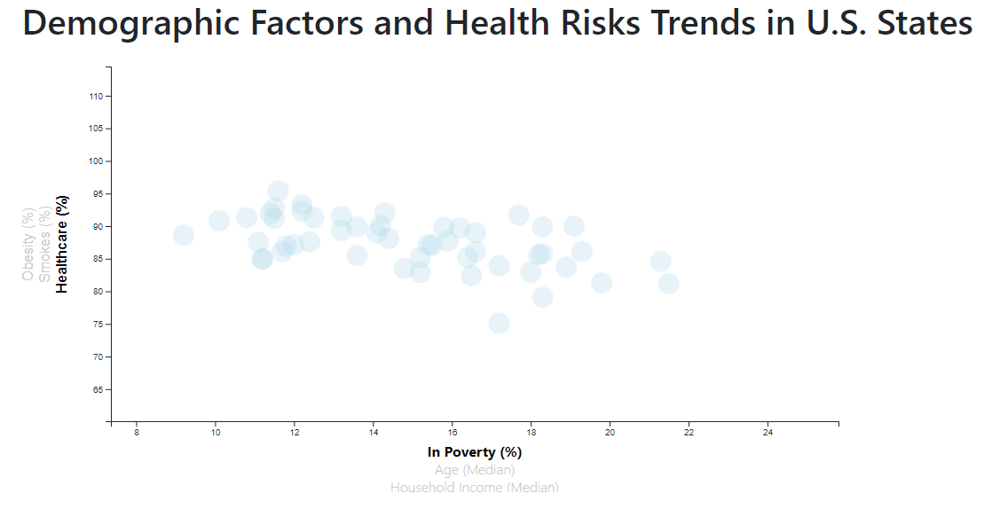

# Health Data by State: Multi-axis D3 Visualization

This project utilizes D3 to visualize U.S. state-based health data across a total of six axes (3 for each axis in the coordinate plan). In total, it offers 9 visualizations of the correlations between various health-related metrics.

---

## Dataset
[Health Data By State](https://github.com/millerbrook/Multi-Axis_D3_Visualization/tree/main/Code/assets/data/data.csv)

---

## Objectives
Give users ability to explore data about health risks linked to particular demographic factors.

### Step 1

Pull in the data from `data.csv` by using the `d3.csv` function.

```
// Retrieve data from the CSV file and execute everything below
d3.csv("assets/data/data.csv")
  .then(function (demoData, err) {
    if (err) throw err;
    // parse data
    var abbrev = [];
    demoData.forEach(function (data) {
      data.healthcare = 100 - data.healthcare;
      data.smokes = +data.smokes;
      data.obesity = +data.obesity;
      data.poverty = +data.poverty;
      data.age = +data.age;
      data.income = +data.income;
      abbrev.push(data.abbr);
    });
```
### Step 2  

Create graph with multiple axes.




### Step 3

Provide some exploratory analysis of the graph.


--
### Contact Information

<<<<<<< HEAD
Brook Miller

[Email](millerbrook@gmail.com)

[LinkedIn](www.linkedin.com/in/brook-miller-data)
=======
Brook Miller  
[Email](millerbrook@gmail.com)  
[LinkedIn](www.linkedin.com/in/brook-miller-data)
>>>>>>> 5ea5d9845f9fa0c35a6c356089fd31a3688292b4
